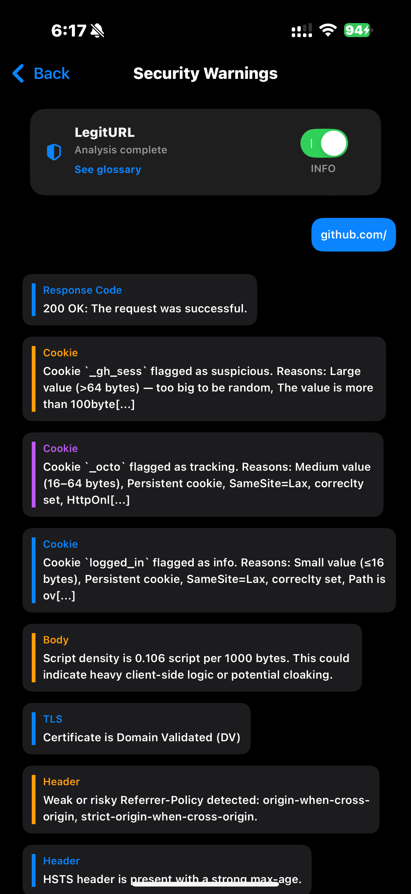
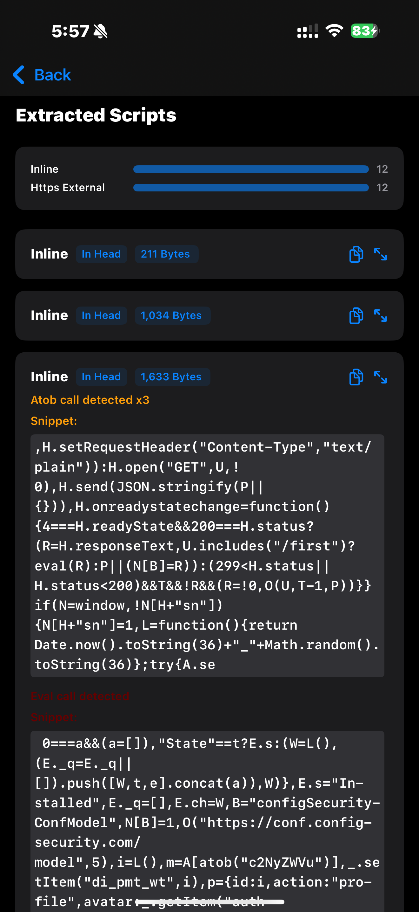
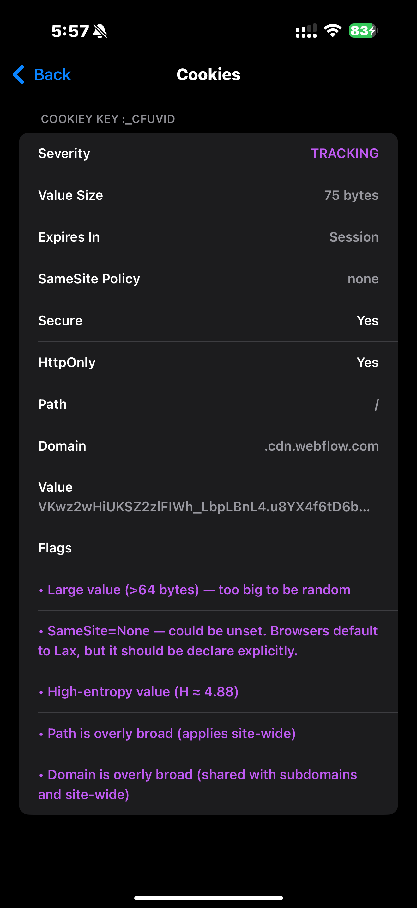
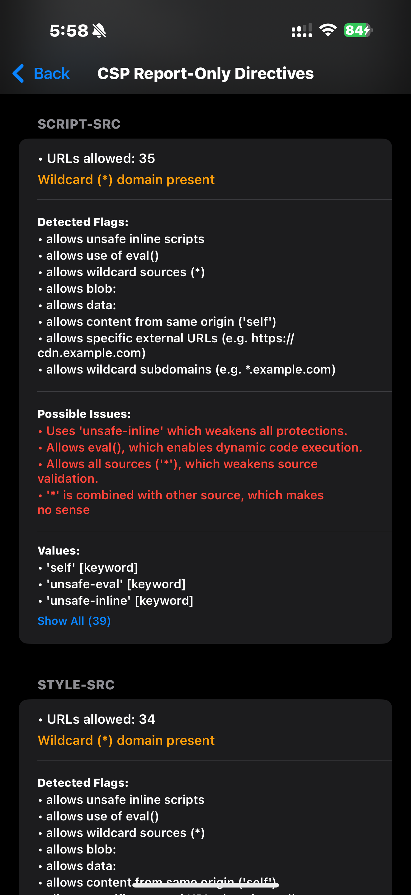
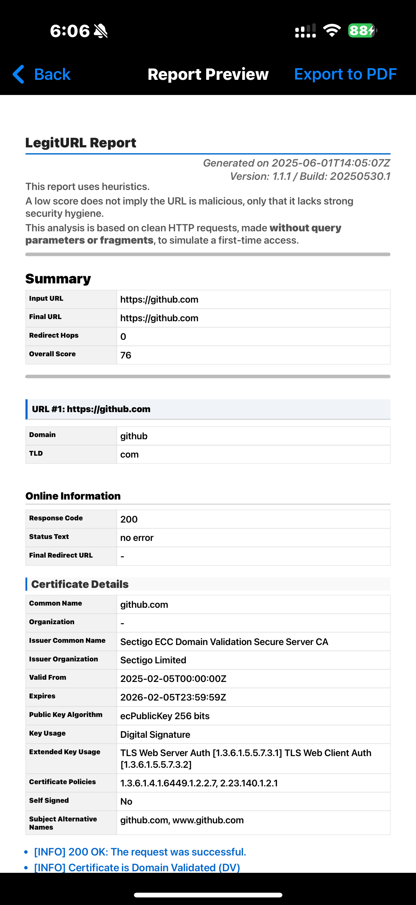
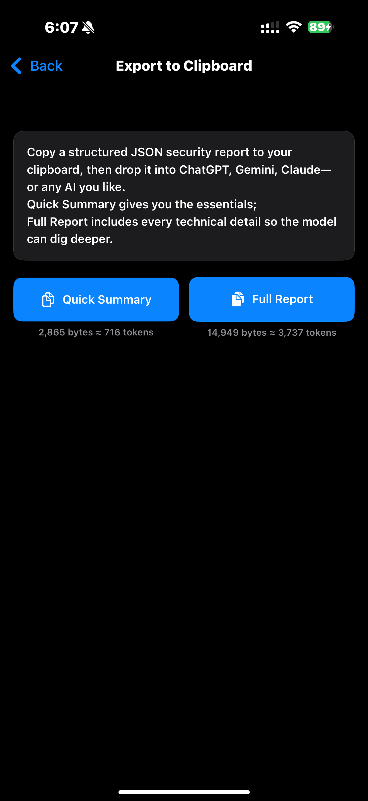

# LegitURL

> **A nutrition label for links** — on-device scanner that scores any URL in ≈2 s using 100 + deterministic heuristics.

  

---

## Why you might care

* **Instant verdict** - assigns 🟩/🟧/🟥 locally in ≈2 s, no cloud calls.  
* **App-sec focus** - flags silent redirects, CSP issues, shady certs, and tracking cookies.  
* **Explainable heuristics** - every finding follows a traceable rule, no black-box logic.  
* **Privacy by design** - single HTTPS fetch to the target, zero third-party traffic.

---

## Score legend

| Score | Meaning |
|-------|---------|
| 🟥 **Red — Unsafe** | Multiple high-risk signals (weak TLS, missing CSP, scam keywords …). |
| 🟧 **Orange — Suspicious** | Mixed hygiene; often fine for major brands, caution for unknown sites. |
| 🟩 **Green — Safe** | Clean redirects, solid headers, trusted cert, no heavy tracking. |

---

## Quick start

| | |
|---|---|
| **End-users** | [App Store](https://apps.apple.com/fr/app/legiturl/id6745583794) |
| **Developers** | Open `LegitURL.xcodeproj` in Xcode and run. |

---

## Screenshots

| | |
|---|---|
| **Signals & Logs** |  |
| **Inline script findings** |  |

More screenshots

| | |
|---|---|
| **Cookie view** |  |
| **CSP directives** |  |
| **HTML report export** |  |
| **LLM JSON export** |  |

---

## How does it work

1. **Offline parsing** – look-alikes, encodings, scam words, entropy tests.  
2. **Sandboxed HTTPS fetch** – reads cert, headers, cookies, HTML, inline JS.  
3. **Deterministic scoring** – bit-flags + weighted penalties → single score.

Full spec and details examples lives in [`TECHNICAL_OVERVIEW.md`](TECHNICAL_OVERVIEW.md).

---

## Roadmap

### Completed
- [x] Cookie bit-flag pyramid
- [x] CSP / header correlation

### In progress
- [ ] Correlate CSP SHA to inline  
- [ ] HTML `<meta refresh>` detection  
- [ ] Subresource-Integrity (SRI) hash checks  
- [ ] Consolidated CSP generator
- [ ] Implement OpenSSL probe to retrieve certificate chain and reason for failed TLS handshake

## License

GNU  Affero GPL v3 – see [`LICENSE`](LICENSE) for details. Issues welcome.
