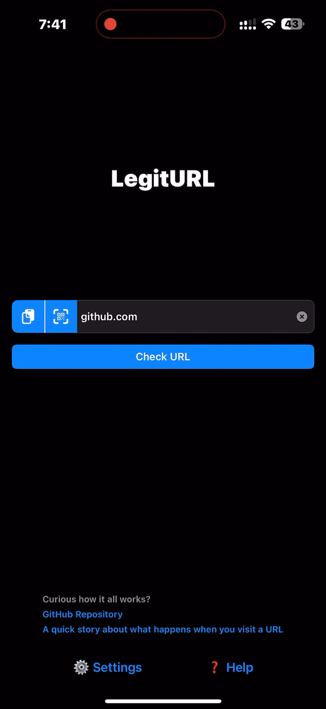
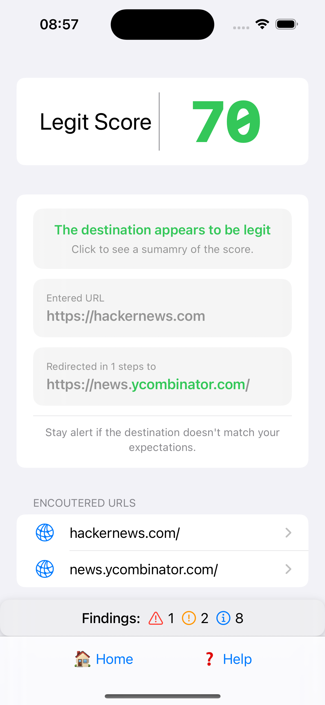
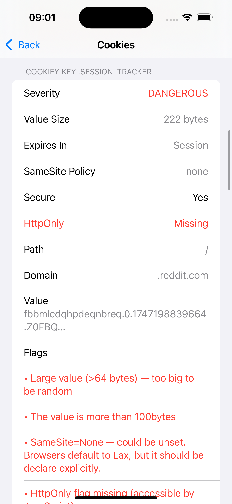
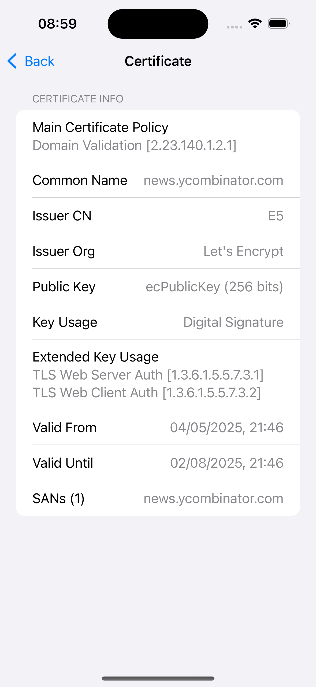
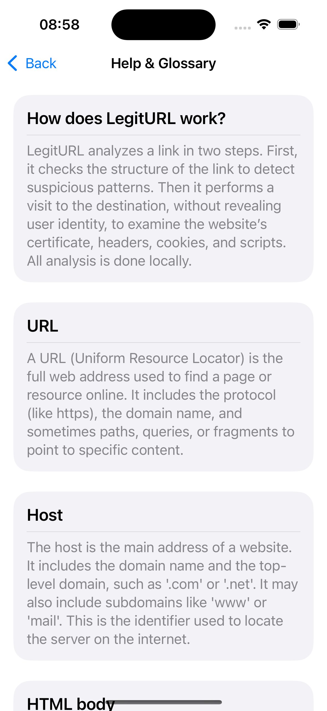

# LegitURL

> **A nutrition label for links** — on-device scanner that scores any URL in ≈2 s using 100 + deterministic heuristics.

  

---

## Why you might care

* **Instant verdict** - assigns 🟩/🟧/🟥 locally in ≈2 s, no cloud calls.  
* **App-sec focus** - flags silent redirects, CSP issues, shady certs, and tracking cookies.  
* **Explainable heuristics** - every finding follows a traceable rule, no black-box logic.  
* **Privacy by design** - single HTTPS fetch to the target, zero third-party traffic.

---

## Quick start

| | |
|---|---|
| **End-users** | [App Store](https://apps.apple.com/fr/app/legiturl/id6745583794) |
| **Developers** | Open `LegitURL.xcodeproj` in Xcode and click to run. |

---

## Score legend

| Score | Meaning |
|-------|---------|
| 🟥 **Red — Unsafe** | Multiple high-risk signals (weak TLS, missing CSP, scam keywords …). |
| 🟧 **Orange — Suspicious** | Mixed hygiene; often fine for major brands, caution for unknown sites. |
| 🟩 **Green — Safe** | Clean redirects, solid headers, trusted cert, no obvious tracking. |

---

## Feature tour

Click for screenshots

| | |
|---|---|
| Home → Analysis |  |
| Logs → URL detail |  |
| Cookies · CSP |  |
| TLS · Scripts |  |
| Glossary |  |

---

## Under the hood

1. **Offline parsing** – look-alikes, encodings, scam words, entropy tests.  
2. **Sandboxed HTTPS fetch** – reads cert, headers, cookies, HTML, inline JS.  
3. **Deterministic scoring** – bit-flags + weighted penalties → single score.

Full spec lives in [`TECHNICAL_OVERVIEW.md`](TECHNICAL_OVERVIEW.md).

---

## License

GNU  Affero GPL v3 – see [`LICENSE`](LICENSE) for details. Issues welcome.
