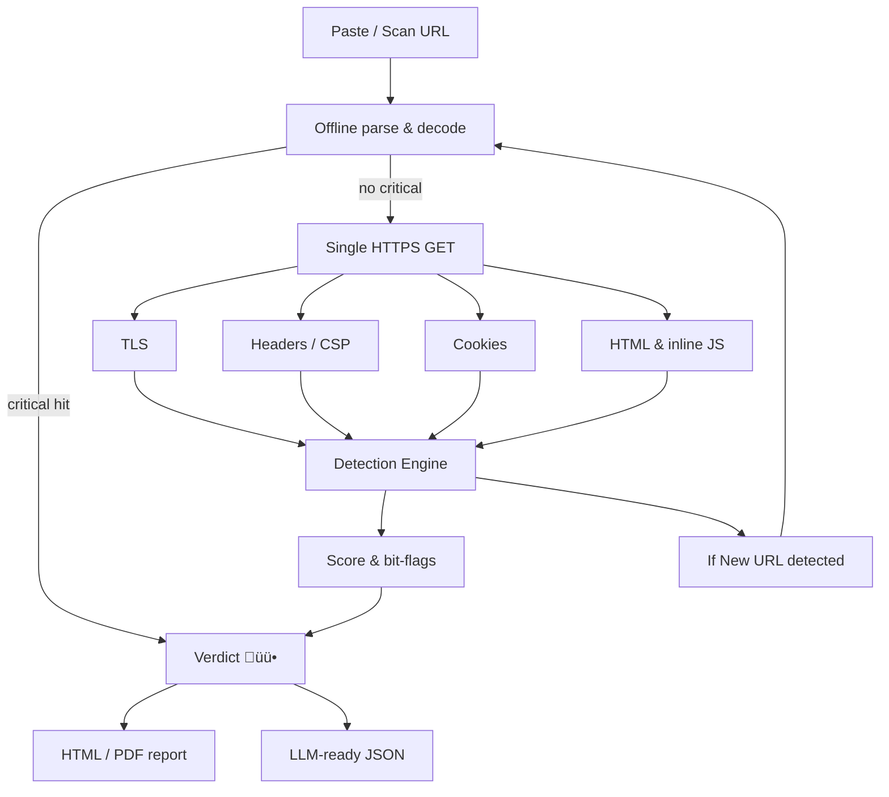

# Technical Overview

| Version | Status | Notes |
|---------|--------|-------|
| 1.1.4   | *stable* | Current public release |

> **LegitURL is a 100 % on-device link scanner.**  
> It rates trust purely from technical behaviour and finishes in < 2 s—no cloud, no sign-ups, no tracking.


## Performance benchmarks — iPhone 16 (-A18/ iOS 18.4)

| Site | HTML | JS | Cookies | Findings | HTML parse | Total | GET |
|------|------|----|---------|----------|------------|----------|--------|
| stripe.com/ae | 2.05 MB | 8 | 1 | 10 | 26 ms | **1.76 s** | 1.71 s |
| store.steampowered.com | 0.78 MB | 25 | 3 | 18 | 22 ms | **0.86 s** | 0.72 s |
| societegenerale.com/fr | 0.08 MB | 68 | 3 | 16 | 15 ms | **1.52 s** | 0.88 s |
| x.com | 0.26 MB | 41 | 6 | 43 | 36 ms | **0.72 s** | 0.63 s |

<sup>Times are wall-clock averages of three runs.</sup>

### Notes

* **Total analysis** = network latency + HTML parse + script/cookie/CSP checks + scoring + **human-report formatting & JSON export**.
* **GET** shows network latency only, not internal logic.  
* Inline scripts are fully parsed in memory; external scripts are analysed via their `src` attribute (no extra fetch yet).

> **Reproduce it:** run `` `testAnalysisEngine_PerformanceForSimpleURL()` `` in **LegitURLTests.swift** (Xcode Debug). Each run performs an actual HTTPS GET and full pipeline analysis—no mocks.

---

## 1 · Overview

### 1.1 . Queue & dissect
* The entered URL is queued, split into domain / sub-domains / path / query / fragment.
* Domain is normalised to Punycode.
* Each part is scanned for brand-spoofs, typos, high entropy, and encoded blobs (Base64, %-encoding, etc.).

### 1.2 . One clean GET
* LegitURL fires a single HTTPS GET with a vanilla iOS User-Agent and no query-string.
* Any redirect target is pushed back into the same queue, so every hop is inspected in turn.

### 1.3 . Signal sweep
* TLS chain -> age, SAN match, issuer.
* Headers -> CSP, HSTS, Referrer-Policy, leaks.
* Cookies -> flags, entropy, redirect phase.
* HTML & inline JS -> structure, risky patterns, nonce/hash ties.

## 2 · How LegitURL Works

LegitURL scores a link solely from its technical behaviour.   
It dissects the URL offline, then performs one sandboxed GET to capture TLS, headers, cookies, HTML, and scripts.  
Deterministic heuristics award or deduct points; a bit-flag engine escalates dangerous combinations.    
Reputation is ignored—only concrete signals matter.  
The result: a transparent üü©/üüß/üü• verdict and a fully-traceable findings log.

> The pipeline ends by rendering two outputs:  
> • a human-readable HTML/PDF report (one page per hop), and  
> • a compact JSON blob primed for LLM analysis.  
> See [§ 3.6 Export & LLM Integration](#3.6-export-llm-integration-and-prompt-strategy) for format details.



## 3 · Detection Engine

LegitURL inspects every layer, from raw URL to inline JS, to surface deterministic, explainable signals.

### Compact reference sets
* **Scam keywords / homoglyphs**
* **Brand whitelist**
* **Suspicious TLDs / infra**
* **Risky JS APIs**

All bundled offline; users can extend keywords and brand.

### Impersonation & obfuscation
* **Levenshtein + n-gram** catch typos (`gooogle.com`) and brand hijacks in sub-domains/paths.  
* Entropy + decoding Base64 / `%`-encoded blobs in path and queries / fragments.

### Five-layer rule grid

| Layer | Focus |
|-------|-------|
| 1 | **URL pieces** – host, path, query |
| 2 | **TLS** – CN/SAN, chain, age |
| 3 | **Headers** – CSP, HSTS, leaks |
| 4 | **Cookies** – size, entropy, flags |
| 5 | **HTML / JS** – tag mix, risky calls |

Each rule gives a **point delta** and, when critical, sets a **bit-flag**.  
Flags accumulate across redirect hops to expose compound risks.

### Context-aware weighting

| Example | Heavier penalty |
|---------|-----------------|
| Tracking cookie on **3xx** vs **200** | **3xx** (redirect tracking) |
| Brand term in foreign host | Non-brand domain |

### INFO-only notes

Low-risk facts (fresh DV cert, tiny cookie, benign internal redirect) log as **INFO**—no score hit unless paired with other flags.

### 3.1 URL & Encoding

LegitURL inspects every link **locally—before any network traffic**.  
If a *critical* offline signal appears, the online phase is skipped.

#### Split & scan

The URL is split into **domain · sub-domains · path · query · fragment**.  
Each part is checked for:

| Signal | Example |
|--------|---------|
| **Brand spoof** | `secure-paypal-login.com` |
| **Look-alike** | Cyrillic + Latin mix, homoglyphs |
| **Scam words** | `account-verify`, `login-secure` |
| **Encoded blobs** | hidden emails, UUIDs, nested URLs |

**Weighting**

* Domain + sub-domains » highest score impact  
* Path + fragment » behavioural context  
* Query values -> recursively decoded by **Lamai** (custom decoder)

#### Technical pipeline

| Step | Purpose |
|------|---------|
| **PSL + URLComponents** | Accurate domain vs. sub-domain split |
| **Punycode normalisation** | ASCII comparison for IDNs |
| **Tokenise on `_`/`-`** | Expose embedded words |
| **Mixed-script check** | Flags Cyrillic/Latin blends |

#### Spoof & entropy heuristics

* **Levenshtein ≤ 1** → typo-squats  
* **2-gram score** ‚Üí brand smushing (`pay‚ÄêpaI`)  
* **System dictionary** ‚Üí confirm real words  
* **Shannon entropy** ‚Üí flag random strings

#### Path / query / fragment drill-down

1. **Recursive decode** – Base64, `%`, Unicode escapes  
2. **Structure scan** – emails, IPs, UUIDs, nested URLs  
3. **Re-queue** any decoded URL (depth ≤ 5)

> *Pruning:* branches that resolve to high-entropy noise are cut early to avoid decoding depth bombs.

### 3.2 TLS Analysis  

LegitURL parses the full X.509 chain **after** `URLSession` trust.  
It layers deterministic heuristics on top—no extra network calls.

| Check | What we inspect | Risk signal |
|-------|-----------------|-------------|
| **Age window** | *New* < 7 days • *Stale* > 13 months. | Fresh DV + weak headers ⇒ throw **orange**; stale cert ⇒ **maintenance doubts**. |
| **CA policy** | DV / OV / EV via policy OID. | + pts for EV/OV; neutral for DV unless combined with other flags. |
| **SAN coverage** | Wildcard vs. enumerated FQDNs; unrelated hosts count. | > 25 mixed SANs without wildcard ‚áí common in burner infra. |

> **Why not custom trust?**  
> Apple rejects apps that bypass `URLSession` PKI. LegitURL therefore accepts system trust.

#### System-trust blind spots

`URLSession` only says “handshake failed,” never *why* (missing leaf, bad chain, untrusted root).  
LegitURL treats any such failure as **critical** and stops further online checks.

### 3.3 Header & Content-Security-Policy

LegitURL treats CSP as the front line of client-side defence.  
Rules fire in this order:

| Goal | Rule | Score impact |
|------|------|--------------|
| **Presence** | No `Content-Security-Policy` header | **Heavy penalty** |
| | Only `…Report-Only` present | Heavy penalty, but still parsed |
| **Syntax** | Header must end with `;` | Auto-append if missing (INFO) |
| | Split directives on `;` → build map | — |
| **Mandatory source** | `script-src` missing ‚Üí fall back to `default-src` ‚Üí if both absent, check `require-trusted-types-for 'script'` | Treat as **incomplete CSP** (same weight as missing) |
| **Bit-flags** | Directive/value combos mapped to flags (`UNSAFE_INLINE`, `UNSAFE_EVAL`, `STRICT_DYNAMIC`, …) | Flags feed scorer |
| **Inline nonce / ext-origin match** | Inline-script nonce or SHA must match `script-src`; external script host must be in allow-list | Mismatch ⇒ penalty • Correct nonce/SHA ⇒ bonus |

> A strict CSP won’t stop every attack, but it **shrinks the attack surface**.  
> When a header is absent or weak, LegitURL proposes a *sample `script-src` directive*:  
> * hashes for ≤ 5 inline scripts, explicit hosts for external scripts, and `nonce-***` guidance when inline count > 5.  
> This example is advisory; heavy, dynamic sites will need additional tuning.

---

#### Other security headers

| Header | Check | Expected / Penalty |
|--------|-------|--------------------|
| `Strict-Transport-Security` | Present + `max-age` ‚â• 31536000 + `includeSubDomains` | Missing or short age ‚áí penalty |
| `X-Content-Type-Options` | Value | Must be `nosniff` |
| `Referrer-Policy` | Value | `strict-origin` or stricter |
| `Server` / `X-Powered-By` | Version leakage (`apache/2.4`, `php/8.2`) | **INFO** if header present but no version • **Suspicious** if version leaks |

### 3.4 Cookies

Every `HTTPCookie` is reduced to a **bit-flag bundle**:

| Flag | Trigger |
|------|---------|
| `httpOnly`          | `HttpOnly` present |
| `secure`            | `Secure` present |
| `persistent`        | Expires > 30 days |
| `smallValue`        | Value < 16 B |
| `largeValue`        | Value > 64 B |
| `highEntropyValue`  | Shannon > 3.5 bits/char |
| `setOnRedirect`     | Arrives on 3xx / 4xx / 5xx |
| `sameSiteNone`      | `SameSite=None` |
| `sameSiteMissing`   | Attribute absent *(not defaulted to `Lax`)* |

> **Why treat missing `SameSite` as risky?**  
> 1. Mobile tracking kits still rely on no-`SameSite` for cross-site POST redirects.  
> 2. Silent browser defaults hide developer intent; explicit ‚â• implicit.  
> 3. `URLSession` flattens duplicate `Set-Cookie` headers, making detection brittle—LegitURL errs on caution.

#### Flag ‚Üí penalty matrix

| Flags raised | Score impact |
|--------------|-------------|
| `smallValue` + low entropy | **Ignored** — likely benign session ID |
| `httpOnly` only            | Minor (CSRF-related, but low risk for read-only scan) |
| `largeValue` + `highEntropyValue` | **Tracking** — strong penalty |
| Any flag on a **3xx** hop  | Additional penalty (redirect tracking) |

> LegitURL simulates a first-visit GET: **no** existing cookies, **no** query params.  
> Any cookie set pre-consent (e.g., RGPD banners) is therefore visible.  
> Scoring weights may evolve as privacy regulations and browser defaults change.

### 3.5 HTML & JavaScript

The full body is tokenised on-device; the UI shows only the first **1.2 MB** of HTML and **3 KB** per inline block, but scoring uses the entire stream.

| Stage | What we do | Risk signal |
|-------|------------|-------------|
| **1. Boundary scan** | Test first / last ± 500 B for `<html>` & `</html>`. | Missing open ⇒ **critical** (non-HTML) • Missing close ⇒ moderate |
| **2. Tag discovery** | Single-pass “< byte” lexer finds `<head>`, `<body>`, `<script>`, and closers. | — |
| **3. Head checks** | Look for `<meta http-equiv="Content-Security-Policy">`. | Extra CSP here vs. header ‚áí **inconsistency** (warning) |
| **4. Script block parse** | Extract `nonce=`, `src=`, `integrity=`, `type=`. Log CORS attrs. | Non-matching nonce/SHA ⇒ penalty • SRI present ⇒ bonus |
| **5. Origin class** | Map each `src` to `'self'`, 3rd-party, protocol-relative, `data:`. | 3rd-party script on site with weak CSP ‚áí penalty |
| **6. Byte-wise JS scan** | Inline code concatenated, then regex-light scan around `(` and `.` tokens. | — |
| **7. Risk patterns** | Match against **risky API list** (`eval`, `atob`, `document.write`, …) and flagged pairings (e.g. `getElementById` → `.submit()`). | Each match adds a per-API delta; paired patterns add combo flag |

### 3.6 Export & LLM Integration

LegitURL turns its findings into two ready-to-share artefacts:

| Output | Format | Purpose |
|--------|--------|---------|
| **Human report** | HTML / PDF, one page per hop | Shareable for audits or incident tickets |
| **Machine bundle** | Compact JSON | Feed directly to GPT-4, Claude, etc. |

#### JSON schema

* Stored as `KeyValuePairs` ‚Üí preserves ordering, zero-padded keys (`04a_`, `04b_`)  
* All prefixes stripped **after** serialisation ‚Üí models see clean keys  
* Two size profiles:  
  * `brief` – topline verdict + key signals (token-friendly)  
  * `full`  – domain breakdown, cookies, TLS, headers, scripts, inline snippets

* No penalty values are embedded — the LLM is free to reason from raw signals.

> Token hint:  
> LegitURL estimates cost by byte-length √∑ 4. A banner warns if export > 8 k tokens (~32 KB).  

| Action | ClipBoard Content |
|--------|--------|
| **Explain Finding** | Minimal JSON for the selected signal |
| **Full Report** | Full schema block |

* *Exploration note - the ChatGPT iOS app currently exposes no share‑sheet hook for pre‑filled content in JSON, so this feature is on hold.*

## 4 · Scoring & Bit-Flag Model

Analysis starts at **100 points** once the first request is queued.  
As LegitURL follows the entire redirect chain, every hop can deduct points from this single running total.

### Individual penalty examples

| Signal | Typical hit |
|--------|-------------|
| Scam keyword in sub-domain | ‚àí20 |
| Watch-list brand misuse in sub-domain | ‚àí25 |
| High-entropy / obfuscated path | ‚àí10 |
| Dangerous JavaScript pattern | ‚àí30 |
| Fresh DV certificate (< 7 d) | ‚àí10 |
| Tracking cookie on 3xx | ‚àí15 |
| CSP missing or no `script-src`, `default-src`, or `require-trusted-types-for 'script'` | ‚àí50 |

*Weights are versioned and will evolve.*

#### Context matters

| Same signal, different context | Result |
|--------------------------------|--------|
| `applepie.com` vs `secure-apple.com` | Only the second triggers **brand-spoof** penalty. |
| Cookie on **200 OK** | Mild warning |
| Same cookie set on **3xx redirect** | Higher penalty (tracking during redirect) |

---

### Bit-flag engine

LegitURL tags some finding with a bit flag (`DOMAIN_SCAM_OR_PHISHING`, `TLS_IS_FRESH`, `HEADERS_CSP_MALFORMED`, …).  
Combinations drop the score faster than individual hits—catching situations where separate “yellow” signals combine into a clear red flag.

| Example combo | Flags raised | Severity |
|---------------|-------------|----------|
| Scam keyword in sub-domain **+** watch-list brand in domain | `SCAM_WORD` ‚àß `BRAND_HIJACK` | **Critical** |
| Fresh DV cert **+** weak headers **+** malformed HTML | `FRESH_DV` ‚àß `WEAK_HDR` ‚àß `HTML_MALFORM` | **Dangerous** |
| Hop 1: `SCAM_WORD` ‚Üí Hop 2: `BRAND_HIJACK` | Chain flags propagate | **Critical** |

> **Why bit-flags?** They provide deterministic, explainable downgrades and let new heuristics slot in without rewriting the whole weight table.

## 5 · Examples

<details>
<summary><strong>Example 1: Brand impersonation with suspicious TLD (Score: 0/100)</strong></summary>

If the user has correctly added `bankoftrust.com` to their **watchlist**, the app will:

- Treat `bankoftrust.com` as a **trusted root domain**
- Skip domain-level penalty checks for it
- Still flag any **use of “bankoftrust”** in unrelated subdomains or domains

---

**Pasted URL: https://secure-login.trustedbank.com.userauth-check.info/session?token=xyz**

**URL Breakdown:**

- **Domain:** `userauth-check`
- **TLD:** `.info`
- **Subdomain:** `secure-login.trustedbank.com`
- **Path:** `/session`
- **Query:** `token=xyz`

---

### Offline analysis:

| Component      | Observation | Signal Type | Action |
|----------------|-------------|-------------|--------|
| **Domain**     | `userauth` not in dictionary | Weak signal | No penalty |
| **TLD**        | `.info` has poor reputation | Moderate signal | -20 penalty |
| **Subdomain**  | Contains scam/phishing terms + brand impersonation (`trustedbank.com`) | Critical combo | Heavy penalty |
| **Path**       | `session` resembles API endpoint (expects value) | Contextual weak signal | -10 penalty |
| **Query**      | Passed to Lamai, no relevant signals found | — | No penalty |

---

### Conclusion:

- Subdomain + `.info` TLD + API-style path forms a **high-risk pattern**
- Offline logic recognizes this combo and applies a **critical penalty**
- Total score drops to **0/100**
- **Online check is skipped** — it's already flagged as too risky

---

### Verdict:

> This URL impersonates a known brand using a deceptive subdomain, a suspicious TLD, and a query path that mimics login flow.  
> **Final Score: 0/100 — flagged as DANGEROUS**

</details>

<details>
<summary><strong>Example 2: Redirect chain with tracking cookies and suspicious scripts (Score: 0/100)</strong></summary>

Let’s say a user encounters a shortened link in a promoted X.com post:  
**Pasted URL: bit.ly/mihoyanagi**

---

**Initial URL Breakdown:**

- **Domain:** `bit`
- **TLD:** `.ly`
- **Path:** `/mihoyanagi`

---

### Offline analysis:

| Component | Observation | Signal Type | Action |
|-----------|-------------|-------------|--------|
| **Path**  | Not recognized by dictionary | None | No penalty |  
| **Redirect** | 301 -> domain changes | Weak signal | -10 |

--> Score 90

---

### Online analysis begins

**Request sent with real iOS User-Agent and clean headers**

---

#### Redirect 1: `https://jolyvip.com/mihoyanagi`

| Component | Observation | Signal Type | Action |
|-----------|-------------|-------------|--------|
| **Path**  | Not recognized by dictionary | None | No penalty |
| **Redirect**     | 302 ‚Üí domain changes again | Weak signal | -10 | 
| **TLS**          | 4 days old | Moderate signal | -10 |
| **Cookie 1**     | 10 bytes, no flags, 31-day lifespan, `SameSite=Lax` | Weak | No penalty |
| **Cookie 2**     | 213 bytes, no flags, `SameSite=Lax` | Moderate | -15 |

---

#### Final URL: `https://coingrok.io`

| Component        | Observation | Signal Type | Action |
|------------------|-------------|-------------|--------|
| **HTML Body**       | 74% inline JavaScript, script density 1.282 | Suspicious | -25 |
| **CSP**             | Missing | |-50 |
| **X-Powered-By**    | `Next.js` backend leaked | Weak signal | -5 |
| **Server Header**   | `cloudflare` | Informational | No penalty |

---

### Verdict:

> This link leads through a **redirect chain with cookie abuse, tracking attempts, and excessive inline scripts**.  
> Final domain leaks stack metadata and hosts CSP violations.  
> **Final Score: 0/100 — flagged as DANGEROUS**
</details>

<details>
<summary><strong>Example 3: Cloaked scam infrastructure via shared TLS Certificate (Score: 0/100)</strong></summary>

Let’s consider the following link:  
**https://www.man-entreprise.com/vrp/ayxxxxxxx/yyyy**  
*(Query parameters have been altered to avoid exposing personal data.)*


---

**Initial URL Breakdown:**

- **Domain:** `man-entreprise`
- **TLD:** `.com`
- **Path:** `/vrp/ayxxxxxxx/yyyy`

---

### Offline Analysis:

| Component | Observation | Signal Type | Action |
|-----------|-------------|-------------|--------|
| **Domain** | Clean | — | No penalty |
| **Path**   | Not recognized, not suspicious | — | No penalty |

**‚Üí Score remains 100**

---

### Online Analysis Begins

**Request sent with real iOS User-Agent and clean headers**

---

#### Redirect 1: `https://ed.manageo.biz/clt-su/SFR/formulaire16_2tps.jsp?...`

| Component       | Observation | Signal Type | Action |
|-----------------|-------------|-------------|--------|
| **Redirect**    | 302 to `.biz` domain | Moderate | -10 |
| **TLD**         | `.biz` — poor reputation | Moderate | -15 |
| **Query string**| Malformed, some keys empty, odd characters | Suspicious | -15 |
| **TLS**         | DV cert (Let's Encrypt), ~10 days old | Informational | No penalty |

---

#### TLS Certificate (from `man-entreprise.com`)

| Attribute         | Value |
|------------------|-------|
| **Type**         | DV (Domain Validation) |
| **Issuer**       | Let's Encrypt |
| **Age**          | 10 days |
| **SAN Entries**  | 76 fully-qualified domains, unrelated, no wildcard | üö® High-risk |
| **Wildcard**     | None |

‚Üí Strong signal of **cloaking infrastructure via shared certificate**

---

#### Final URL: `https://ed.manageo.biz`

| Component         | Observation | Signal Type | Action |
|-------------------|-------------|-------------|--------|
| **Response**      | 200 OK | — | — |
| **Cookie**        | `JSESSIONID` missing `Secure` flag | Weak | -10 |
| **Script origin** | Undetectable or malformed | Suspicious | -15 |
| **Script density**| 1.325 scripts per 1000 bytes | Abnormally high | -15 |
| **TLS**           | DV cert, Let's Encrypt, 25 unrelated SANs | Infra signal | -30 |

---

### Verdict:

> This link leads to a **suspicious redirect chain** starting from a clean domain that shares a **Let's Encrypt DV certificate** with 76 unrelated sites.  
> It lands on a `.biz` domain serving **cloaked or obfuscated JavaScript**, with **leaked personal data** and malformed query patterns.  
> The final destination shares a similarly structured certificate — indicating **shared scam infrastructure** at scale.

**Final Score: 0/100 — flagged as CRITICAL**
</details>

<details>
<summary><strong>Example 4: Popular sites that score poorly when judged blind</strong></summary>

These sites are globally recognized — but when analyzed blindly, as if they were unknown, their setups fall short.

| Site               | **Score** | Key issues |
|--------------------|---------:|------------|
| www.google.com     | **49/100** | CSP is *report‚Äëonly* (`unsafe-eval`); sets tracking cookies |
| m.youtube.com      | **18/100** | 92‚ÄØ% of HTML is JS; one inline script > 100kb; tracking cookies; missing `</body>`; no `object-src` , no `Referrer-Policy` |
| m.facebook.com     | **0/100** | 96‚ÄØ% JS; three large cookies ; one inline is scrip > 100kb; nonce value entropy is low ; editing cookie in JS despite non accessible JS cookie ; `unsafe-eval` present |
| amazon.com         | **20/100** | Inline `document.write`; CSP header missing, no `X-Content-Type`, no `Referrer-Policy` |

> These aren’t scams - but if we didn’t already trust them, **nothing in their technical behavior would give trust signal.**  
> This shows hygiene gaps, not proven scams.
> Inline scripts are currently penalized equally; future versions will reduce the penalty if nonce-matching is detected.

</details>

<details>
<summary><strong>Example 5: Popular sites that score good</strong></summary>

Some high-profile sites make a visible effort to secure users — and it shows.

| Site                                | Score   | Notes |
|-------------------------------------|---------|-------|
| stripe.com                        | **100/100**  | one cookie set and JS-accessible, CSP is missing object-src |
| immatriculation.ants.gouv.fr    | **100/100**  | heavy page (3MB) 95% is JS; CSP allows 5 script sources, but only 1 is used |
| apple.com                         | **80/100**  | CSP includes `unsafe-inline` and `unsafe-eval`; weak `Referrer-Policy` |

> Stripe clearly wants to appear trustworthy — and backs it up with real protections al inline are protected by a hash, and a EV cert.  
> The French government site is solid and has a EV cert.  
> Apple's CSP still allows unsafe-inline/unsafe-eval; referrer policy is lax, the EV cert helps.
</details>

## 6 · Case Studies


### 6.1 SAN-pattern analysis – spotting cloaked infrastructure
<details>
<summary>Why 76 unrelated SANs = red flag, and counter-exemple</summary>

### SAN‑pattern analysis – spotting cloaked infrastructure

LegitURL examines the **Subject Alternative Name (SAN)** list for signals that a certificate is protecting more than just a normal “set of sub‑sites.”

####‚ÄØRed‚Äëflag pattern

> **Many (10 – 100) unrelated FQDNs**, no wildcard entries, and a certificate age < 30 days - especially when the issuer is Let’s Encrypt,  strongly suggests throw‑away scam infra.

| Why this pattern is rare on legitimate sites |
|----------------------------------------------|
| **Wildcards are cheaper to maintain** — orgs usually issue `*.example.com`. |
| **Let’s Encrypt wildcards require DNS‑01** — attackers prefer HTTP‑01 because they don’t own DNS. |
| **Dozens of disparate FQDNs** make no operational sense for normal businesses but are perfect for phishing kits, redirect chains, and disposable botnet mailers. |

A SAN list packed with unrelated domains is therefore scored as **“Cloaked Infra”**.  
When combined with weak headers, shady TLDs (`.biz`, `.click`), or obfuscated JavaScript, the overall risk escalates quickly.

####‚ÄØCounter‚Äëexample: Steam

* `steampowered.com` → 48 SAN entries, Let’s Encrypt DV, no wildcard.  
* Immediate redirect to `store.steampowered.com` ‚Üí EV cert, only 2 SANs.

Because the chain lands on a **stronger, scoped EV certificate**, LegitURL waives the penalty for the first hop, context overrules the raw SAN count.

</details>

### 6.2 LLM interpretation – “portal-finance.net”
<details>
<summary>How Claude Sonnet 4 explained the risk from the raw JSON export</summary>

One real-world example involved the domain `portal-finance.net`:

- The model correctly:
  - Flagged the domain as **visually and phonetically similar to “binance”**, using the app’s Levenshtein and n-gram results
  - Identified the external file `/hidden/payload.js` as suspicious due to its naming  
    - **This is exactly what LegitURL was designed to highlight** — the model connected filename patterns to real threats
  - Noted the absence of CSP, HSTS, and SRI headers
  - Connected the TLS issue date (same-day issuance) to likely phishing deployment

All without relying on brand blocklists — purely via behavioral pattern recognition.

> This confirmed that the combination of exported JSON + well-primed instructions can enable GPT-4o, Gemini, Claude or DeepSeek to produce a strong, accurate risk explanation from raw technical input. While the priming is still refined manually, the balance between guiding and overconstraining the model remains a key challenge.  
>
> The model’s ability to leverage background knowledge is exceptionally powerful. Prior attempts to detect such threats relied on static brand lists, dictionary lookups, or entropy checks — all of which struggled against infinite variations. This new pipeline offers a more flexible and adaptive path forward.  
>
> As of now, LegitURL measures JSON export efficiency not only by minimizing token size (still a work in progress), but also by evaluating the **cognitive load** placed on the model,that is, how easily it can extract structure, identify key signals, and reason across findings.  
>
> **LegitURL remains a fully offline local tool**, but this JSON export adds a new layer: enabling models to provide meaningful insight without deep technical parsing. Suspicious inline script snippets are extracted, structured, and passed in clean blocks — letting models focus on interpretation, not AST traversal.


```text
Claude Sonnet 4:

Looking at the technical behavior of portal-finance.net, I see several concerning signals that suggest this site should be approached with extreme caution.

## Critical Red Flags

**Domain Impersonation**: The domain "portal-finance.net" appears designed to mimic Binance, one of the world's largest cryptocurrency exchanges. The analysis shows "FINANCE" has a Levenshtein distance of only 1 from "binance" and 71% structural similarity. This is a classic impersonation tactic used by scammers to trick users into thinking they're visiting a legitimate financial platform.

**Brand New Certificate**: The TLS certificate was issued just yesterday (May 29, 2025) - literally 0 days old when tested. Legitimate financial services don't typically launch with same-day certificates. This suggests the site was created very recently, which is common with scam operations that get shut down and recreate quickly.

**Suspicious Script Loading**: The site loads an external script from a relative path `./assets/hidden/payload.js` - the name "payload" combined with being in a "hidden" directory is highly suspicious. Legitimate sites don't typically name their JavaScript files "payload" or hide them in directories with such obvious names. This could contain malicious code.

## Security Hygiene Issues

The site exhibits poor security practices across multiple areas:

- **Missing Security Headers**: No Content Security Policy, X-Content-Type-Options, Referrer-Policy, or HSTS headers. This creates vulnerabilities and suggests the operators don't follow security best practices.
- **No Script Integrity**: External scripts lack Subresource Integrity (SRI) hashes, meaning if the jQuery CDN or the local server were compromised, malicious code could be injected.
- **Aggressive Caching Prevention**: The "no-store" cache control header prevents any caching, which while not inherently malicious, is unusual for static content and could indicate frequently changing content.

## Behavioral Context

The inline JavaScript appears benign (clipboard copying functionality), but this could be a facade. The real concern is the external "payload.js" script that wasn't analyzed but has a highly suspicious name and location.

## Trust Assessment

This combination of signals - domain impersonation of a major crypto exchange, same-day certificate issuance, suspicious script naming, and poor security hygiene - creates a pattern consistent with cryptocurrency scam sites. These operations typically create convincing-looking finance portals to steal login credentials or crypto wallet information.

A cautious user should avoid this site entirely. The technical behavior suggests it was hastily constructed to impersonate Binance, likely for fraudulent purposes. The risks far outweigh any potential legitimate use case.‚Äã‚Äã‚Äã‚Äã‚Äã‚Äã‚Äã‚Äã‚Äã‚Äã‚Äã‚Äã‚Äã‚Äã‚Äã‚Äã
```
</details>


## 7 · Architecture & Dependencies

LegitURL is built almost entirely on **Swift Foundation**.  
Only two third‚Äëparty libraries are used:

| Dependency | Purpose | License |
|------------|---------|---|
| **[ASN1Decoder](https://github.com/filom/ASN1Decoder)** | Decodes X.509 certificates (CN, SAN, issuer, extensions). | MIT |
| **[PunycodeSwift](https://github.com/gumob/PunycodeSwift)** | Converts IDNs to ASCII (ACE) for uniform comparisons. | MIT |

### Internal reference lists

| Dataset | Used for | Editable | Stored as |
|---------|----------|----------|-----------|
| Mozilla PSL | Domain split, mixed-script check | — | SQLite |
| Brand whitelist | Brand-spoof detection | ‚úÖ | JSON |
| Scam keywords | Sub-domain & path heuristics | ‚úÖ | JSON |
| Risky JS APIs | Inline-script scan | — | Swift array |

*Lists load at startup and can update in-app without a new binary.*

### Matching & scanning strategy

* Single **O(n)** sweep keeps total run time ≈ 2 s.  
* String checks: `.contains` on case-folded ASCII.  
* Byte lexer: skips whitespace/`LF`; extracts tags & JS tokens without a full AST.

### Lamai decode tree

1. **Base64** (auto-pad)  
2. **URL / Unicode escapes**  
3. Branch on each decode (depth ≤ 5)  
4. Node tests: brand/scam hits, UUID, IP, e-mail, nested URL, JSON shape  
5. If branch is high-entropy junk ‚Üí prune

Decoded URLs re-enter the offline queue, ensuring nested phishing links score like any top-level target.

## 8 · License & Contribution

LegitURL is distributed under the **GNU AGPL v3** license.  
You may use, study, and modify the code—even in commercial projects—**but any derivative that runs over a network must publish its own source under the same license**.  
For the full terms see [`LICENSE`](LICENSE) or the [AGPL FAQ](https://www.gnu.org/licenses/agpl-3.0-faq.en.html).

## How to Contribute
Pull requests are welcome! If you find a bug, spot a false positive, or want to add a new heuristic.

But feel free to open an issue or email me if you spot something weird or want to help.
